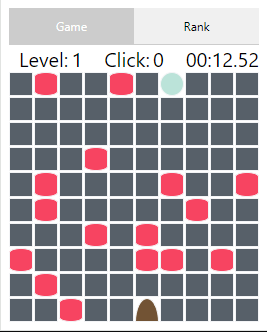

# MazeBall
## Introduction:
MazeBall is a Chrome extension game where players control a ball by clicking the left and right mouse buttons on the page. The goal is to navigate the ball to the bottom destination to proceed to the next level.

## Rules:
1. Use the left mouse button to control the ball's horizontal movement. Clicking on the page will move the ball based on the mouse's relative position.
If the mouse is to the left of the ball, it will move left. If the mouse is to the right of the ball, it will move right. Otherwise, the ball will remain stationary.
2. Use the right mouse button to move the ball downward.
3. The game ends when the countdown timer reaches zero.
4. Colliding with red obstacles will result in game over.

# MazeBall
## 简介：
这是一个Chrome的插件小游戏，玩法是在页面上点击鼠标的左右键，控制小球移动，到达最下层目的地则进入下一关。
## 规则：
1. 鼠标左键控制小球左右移动，点击页面，小球会根据鼠标的相对位置来移动。
   如果鼠标在小球的左边则左移，鼠标在小球的右边则右移，其他则不动。
2. 鼠标右键控制小球向下移动。
3. 倒计时归零则游戏结束。
4. 碰到红色障碍物则游戏结束。

